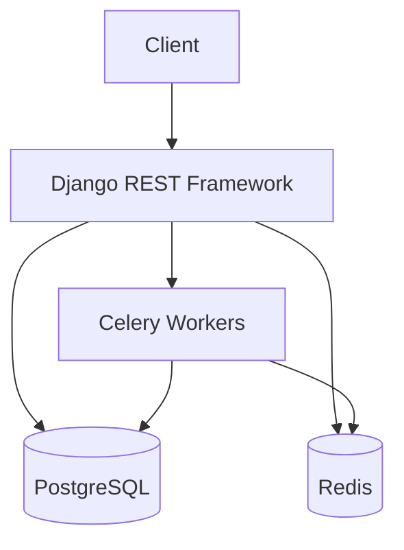

# Architecture

## Technology Stack
- **Backend:** Django 6.1.1, DRF 3.18, Celery 5.6
- **Database:** PostgreSQL 17, Redis 8
- **Frontend:** React 19, Vite (Note: Frontend repo separate)

## System Architecture Diagram

## Module Overview
- **Core:** School model and tenant base.
- **Accounts:** Roles, Profiles, JWT auth, AuditLog.
- **Academics:** Subjects, Classes.
- **Students:** Demographics, medical, relations.
- **Admissions:** Application workflow.
- **Attendance:** Daily marking.
- **Activities:** Assignments, events.
- **Communications:** Internal messaging.
- **Fees:** Invoicing, payments.
- **Reporting:** Generated reports.
- **Warehouse:** ETL & analytics.
- **AI Assistants:** Chatbot integrations.
- **Public Site:** External CMS.

## Authentication & JWT Lifecycle
Users login to receive access (1h) and refresh (24h) tokens. The JWT payload includes the `role` to dictate DRF permissions. Tokens are refreshed via standard SimpleJWT endpoints.
