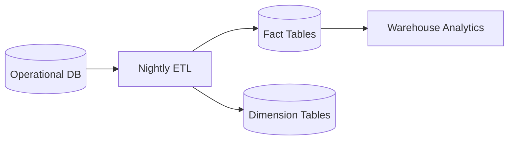

# Data Dictionary

## Core Entities
- **User:** Django auth user.
- **Profile:** Extends user with `role` (Admin, Teacher, Student, Parent, Applicant).

## KPIs
- **Attendance Rate:** % of days present.
- **Grade Average:** Cumulative GPA.
- **Fee Collection Rate:** Paid vs Invoiced amount.
- **Enrollment Counts:** Active students per term.

## Data Lineage

